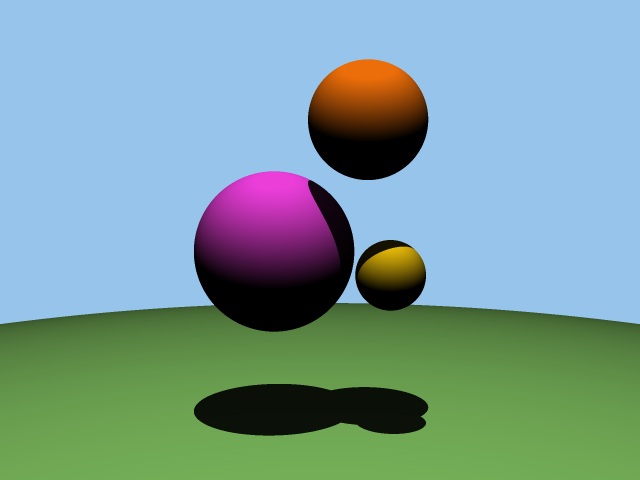

# 3D Ray Tracing Renderer in C

This is a personal project to create a 3D ray tracing renderer from scratch in C, using the `raylib` library for windowing and input. The renderer is capable of rendering scenes with spheres, lighting, shadows, and anti-aliasing. This project was originally started as an assignment for CMPUT 201 at the University of Alberta.


## Table of Contents

- [**Features**](#features)
- [**Controls**](#controls)
- [**How to Use**](#how-to-use)
- [**Project Structure**](#project-structure)
- [**Implementation and Theory**](#implementation-and-theory)
    - [Vectors in 3 Dimensions](#vectors-in-3-dimensions)
    - [Rays](#rays)
    - [The Camera and Viewport](#the-camera-and-viewport)
    - [Representing RGB Colors Using 3D Vectors](#representing-rgb-colors-using-3d-vectors)
    - [Light and Background Color](#light-and-background-color)
    - [Spheres and the World](#spheres-and-the-world)
    - [Checking for Sphere Intersection](#checking-for-sphere-intersection)
    - [Conversion Between HEX and RGB Color Formats](#conversion-between-hex-and-rgb-color-formats)
    - [Assigning Colors](#assigning-colors)
    - [Lighting and Calculating Color](#lighting-and-calculating-color)
    - [Casting Shadows onto Surfaces](#casting-shadows-onto-surfaces)
    - [Anti-Aliasing](#anti-aliasing)
- [**Future Work**](#future-work)

## Features

*   **Ray Tracing:** Renders scenes by tracing rays from a camera into a 3D world.
*   **Spheres:** The only geometric primitive currently supported.
*   **Lighting:** A single point light source illuminates the scene.
*   **Shadows:** Spheres cast shadows on other spheres.
*   **Anti-Aliasing:** Uses grid sampling to smooth out jagged edges.
*   **Real-time Rendering:** Uses `raylib` to display the rendered scene in a window.
*   **Camera Controls:** Basic camera movement is implemented.

## Controls

*   **W**: Move forward
*   **S**: Move backward
*   **A**: Move left
*   **D**: Move right
*   **Space**: Move up
*   **Left Shift**: Move down

## How to Use

### Cloning

This repository uses `raylib` as a git submodule. To clone the repository and its submodules, use the following command:

```bash
git clone --recurse-submodules https://github.com/Captiosus510/3d_renderer.git
```

If you have already cloned the repository without the submodules, you can initialize them with:

```bash
git submodule update --init --recursive
```

### Building and Running

1.  **Compile the project:**
    ```bash
    make
    ```
2.  **Run the renderer:**
    ```bash
    ./raytracer <input_file>
    ```
    For example:
    ```bash
    ./raytracer testcases/11_input.txt
    ```

## Project Structure

The source code is organized into several files in the `src/` directory:

```
src/
|-- assg.c
|-- vector.h
|-- vector.c
|-- spheres.h
|-- spheres.c
|-- color.h
`-- color.c
```

-   `assg.c`: The main file containing the rendering loop and `raylib` integration.
-   `vector.c`/`vector.h`: A library for 3D vector math.
-   `spheres.c`/`spheres.h`: Manages the spheres in the world.
-   `color.c`/`color.h`: Handles color conversions and comparisons.

A `Makefile` is provided to compile the project.

## Implementation and Theory

This section explains the math and implementation concepts behind the renderer.

### Vectors in 3 Dimensions
A 3D vector is a way to represent direction and magnitude in 3D space. A vector can denote a point in space, a direction, or many other things. In this assignment, they will be used to describe direction and position of objects in our world. A 3D vector can be represented using 3 real numbers, and they are represented using an arrow and written as

$$\vec{v}=(a,b,c)$$

Where $a,b,c$ are real numbers. Since we're using vectors to represent positions and directions, we can think of $a$ corresponding to the $x$ axis, $b$ to the $y$ axis, and $c$ to the $z$ axis.

In C, structs make it very easy for us to implement a 3D vector type:

```C
typedef struct {
    float x;
    float y;
    float z;
} Vec3;
```

The following operations are implemented for `Vec3`:
1. **Vector addition:**
   
   $$\vec{v}+\vec{u}=(v_1+u_1,v_2+u_2,v_3+u_3)$$

2. **Vector subtraction:**
 
   $$\vec{v}-\vec{u}=(v_1-u_1,v_2-u_2,v_3-u_3)$$
   
3. **Scalar Multiplication:**

   $$s\vec{v}=(sv_1,sv_2,sv_3)$$
   
4. **Scalar Division:**

   $$\frac{\vec{v}}{s}=\left(\frac{v_1}{s},\frac{v_2}{s},\frac{v_3}{s}\right)$$
   
5. **The Dot Product:**

    $$\vec{v}\cdot\vec{u}=v_1u_1+v_2u_2+v_3u_3$$

    This represents the cosine of the angle between the two vectors.
6. **The Length of a Vector:**

    $$\left|\vec{v}\right|=\sqrt{v_1^2+v_2^2+v_3^2}=\sqrt{\vec{v}\cdot\vec{v}}$$

7. **Distance Between 2 Vectors:**

    $$\text{dist}(\vec{v},\vec{u})=\left|\vec{v}-\vec{u}\right|$$

8. **Normalization of a Vector:**

    $$\text{norm}\;\vec{v}=\frac{\vec{v}}{\left|\vec{v}\right|}$$

    This represents a new vector that is in the same direction as $\vec{v}$, but has length equal to $1$.

### Rays
A ray is simply a line in 3D space that we represent using two 3D vectors, a _position vector_ $\vec{p}$, and a _direction vector_ $\vec{d}$. The position vector describes any point on the line. The direction vector describes the direction in which the line (ray) extends into. We can write any line as a function using these two vectors:

$$R(t)=\vec{p} + t\vec{d}$$

where $t$ is any scalar. One can see that inputting different values $t$ into the $R$ yields different points on the line. In fact, _any_ point on the line can be given by $R(t)$ for some real number $t$.


### The Camera and Viewport

The purpose of rays is to check if they intersect with anything in our world. Each ray corresponds to exactly one pixel (for now). After a ray intersects with any geometry, the color is calculated and the pixel is colored accordingly. In order to cast rays through each pixel of our image, we need to map the dimensions of our 2D image, into a 2D viewport in the 3D world.


The viewport is simply a rectangle in front of the camera. All rays are shot from the camera (a single point) in the direction of, and through the viewport. Its purpose is to determine the image's field of view, scale, viewing direction, etc.

The position of the camera is always at $(0,0,0)$ and points towards the negative $z$ axis.


To produce a ray, we must calculate a position vector and a direction vector.
- The position vector will always be the camera's position.
- The direction vector will go from the camera to the centre of one pixel on the viewport.

### Representing RGB Colors Using 3D Vectors

RGB colors are represented using a `Vec3` with values in the range $[0,1]$. For example, red is `(1.0, 0.0, 0.0)`, white is `(1.0, 1.0, 1.0)`, and black is `(0.0, 0.0, 0.0)`.

### Light and Background Color

The scene is lit by a single point light source with a position and brightness. The background color is uniform and not affected by the light.

### Spheres and the World

The scene is composed of spheres, each with a position, radius, and color. The `World` data structure is a dynamic array that stores all the spheres in the scene.

### Checking for Sphere Intersection

To check if a ray intersects a sphere, we solve a quadratic equation. A ray can be written as:

$$R(t)=\vec p+t\vec d, t\in\mathbb{R}$$

A sphere can be written as:

$$(\vec x-\vec c)\cdot(\vec x-\vec c)=r^{2}$$

Substituting the ray equation into the sphere equation gives a quadratic equation in terms of $t$:

$$t^2(\vec d\cdot \vec d)+2t\vec d\cdot(\vec p-\vec c)+(\vec p-\vec c)\cdot(\vec p-\vec c)-r^{2}=0$$

The discriminant of this equation tells us if there are 0, 1, or 2 intersections.

### Conversion Between HEX and RGB Color Formats

Colors are provided in the input file in HEX format (e.g., `0x00FF33`) and are converted to RGB in the range $[0,1]$ for rendering.

### Assigning Colors

A list of colors is provided in the input file. This list is sorted, and spheres are assigned a color based on an index into this sorted list.

### Lighting and Calculating Color

The final color of a pixel is calculated based on the color of the sphere it intersects and the intensity of the light at the intersection point. The light intensity is calculated as:

$$
I=\min(1,I_{0})\qquad\text{ where }\qquad I_{0}=b\times\frac{\max(\vec{d}\cdot\vec{n},0)}{\text{dist}(\vec{l},\vec{p})^{2}}
$$

Where:
- $b$ is the light brightness
- $\vec{d}$ is the normalized direction from the intersection point to the light source
- $\vec{n}$ is the surface normal at the intersection point
- $\vec{l}$ is the light position
- $\vec{p}$ is the intersection point

### Casting Shadows onto Surfaces

To create shadows, a ray is cast from the intersection point towards the light source. If this ray intersects another sphere, the point is in shadow, and its color is darkened.




### Anti-Aliasing

Grid sampling anti-aliasing is used to smooth out jagged edges. Each pixel is sampled 9 times in a 3x3 grid, and the final color is the average of these samples.


## Future Work

The next major step for this project is to move the rendering logic to the GPU using shaders (GLSL). This will provide a significant performance boost and allow for more complex scenes and effects.
